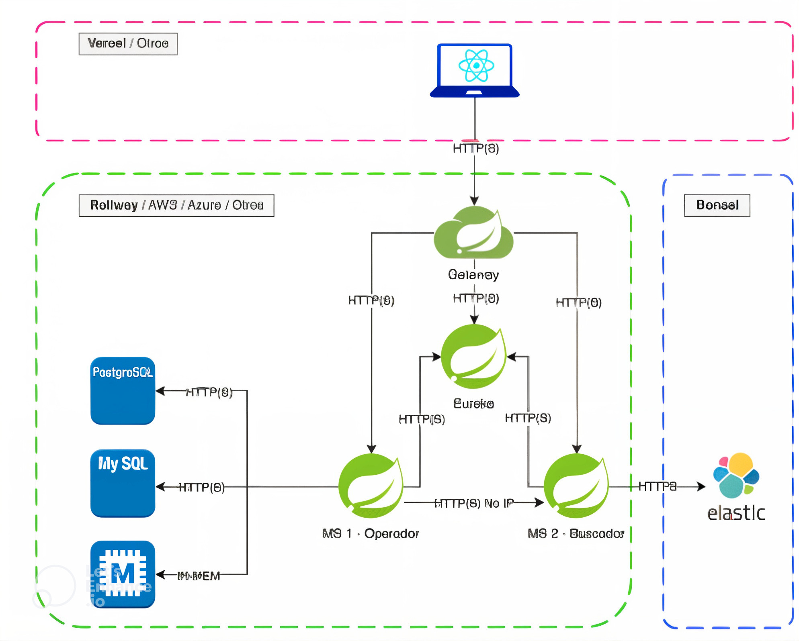
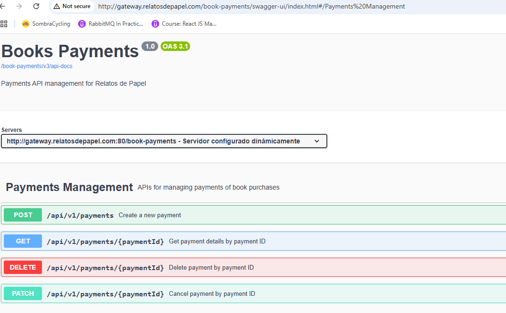

# **ms-books-payments**

## **Descripción General**
El microservicio **ms-books-payments** es el componente central encargado de gestionar los pagos de las compras de libros en la aplicación **Relatos de Papel**. Este microservicio es responsable de:

- **Procesar pagos**: Creación y gestión de transacciones de pago.
- **Validar el stock de libros**: Consulta al microservicio **ms-books-inventory** para verificar la disponibilidad del stock antes de confirmar el pago.
- **Reducir o restaurar el stock**: Reduce el stock al confirmar una venta y lo restaura en caso de cancelación del pago.
- **Integración dinámica**: Se registra automáticamente en el sistema de **descubrimiento de servicios (Eureka)** y expone sus endpoints a través del **API Gateway**, asegurando escalabilidad y flexibilidad.

Este microservicio está diseñado siguiendo los principios de **REST** y emplea **HATEOAS** (Hypermedia as the Engine of Application State) para enriquecer las respuestas de la API.

---
## **Estructura del Proyecto**
El proyecto sigue una arquitectura basada en capas para garantizar la separación de responsabilidades. A continuación, se detalla la estructura del proyecto:

ms-books-payments
```
📁 src
├── 📁 main
│   ├── 📁 java
│   │   └── 📁 es.unir.relatosdepapel.books
│   │       ├── 📁 controller       # Controladores REST o de API
│   │       ├── 📁 model            # Entidades JPA o modelos de datos
│   │       ├── 📁 repository       # Repositorios JPA o interfaces de acceso a datos
│   │       ├── 📁 service          # Lógica de negocio y servicios
│   │       ├── 📁 hateoas          # Configuración y ensambladores HATEOAS
│   │       ├── 📁 dto              # Objetos de transferencia de datos
│   │       ├── 📁 config           # Configuración de la aplicación (Beans, seguridad, etc.)
│   │       └── 📁 exception        # Manejo de excepciones personalizadas
│   └── 📁 resources
│       └── 📄 application.properties  # Configuración de la aplicación
├── 📁 test
│   ├── 📁 java                     # Clases de pruebas unitarias y de integración
│   └── 📁 resources                # Archivos de configuración de prueba
```

## **Arquitectura de la Aplicación**



El microservicio **ms-books-payments** forma parte de la arquitectura distribuida, integrándose con los siguientes componentes:

- [**API Gateway**](https://github.com/Angelica-Quevedo-unir/ms-springcloud-gateway): Enruta las solicitudes externas a los microservicios correspondientes.
- [**Eureka Server**](https://github.com/Angelica-Quevedo-unir/ms-eureka-server): Gestiona el registro dinámico y la detección de servicios.
- [**ms-books-catalogue**](https://github.com/Angelica-Quevedo-unir/ms-books-catalogue): Gestiona el stock de los libros y se consulta directamente para validar la disponibilidad y actualizar el stock según sea necesario.

---

## **APIs Expuestas**

| **Método** | **Endpoint**                    | **Descripción**                                    |
|------------|---------------------------------|--------------------------------------------------|
| **POST**   | `/api/v1/payments`              | Crea un nuevo pago y valida el stock de libros.  |
| **GET**    | `/api/v1/payments/{paymentId}`  | Recupera los detalles de un pago específico.     |
| **PATCH**  | `/api/v1/payments/{paymentId}`  | Cancela un pago existente y restaura el stock.   |
| **DELETE** | `/api/v1/payments/{paymentId}`  | Elimina un registro de pago del sistema.         |

---

## **Servicios Principales**
### **1. Servicio de Pagos (`PaymentService`)**
Este servicio contiene la lógica de negocio relacionada con la gestión de los pagos y su interacción con el inventario:

- **`processPayment(PaymentRequestDTO request)`**: Procesa un nuevo pago, valida el stock y reduce la cantidad disponible.
- **`getPaymentById(Long paymentId)`**: Recupera un pago específico por su ID.
- **`cancelPayment(Long paymentId)`**: Cancela un pago existente y restaura el stock del libro.
- **`deletePayment(Long paymentId)`**: Elimina un pago del sistema.

---

## **Swagger UI**
El microservicio utiliza **Swagger UI** para documentar y probar la API de manera interactiva. Puedes acceder a la interfaz de Swagger en la siguiente URL una vez que el microservicio esté en ejecución:

```
http://${HOST}/book-payments/swagger-ui/index.html#
```
### **Imagen de Swagger UI**
A continuación, se muestra una captura de pantalla de la interfaz de Swagger UI:


---

## **Health Check**
El microservicio expone su estado mediante el siguiente endpoint:
- **GET /admin/health**: Proporciona información sobre el estado del microservicio, indicando si está operativo y saludable.
```
http://${HOST}/book-payments/admin/health
```
---

## **Configuración del Proyecto**
### **Requisitos Previos**
- Java 17 o superior
- MySQL 8.x
- Maven 3.x
- Docker (opcional, para despliegue en contenedores)

### **Instalación y Ejecución**
1. Clona el repositorio del proyecto.
2. Configura las variables de entorno en `application.properties` para la conexión a la base de datos.
3. Ejecuta el siguiente comando para construir el proyecto:
   ```bash
   mvn clean install
   ```
4. Inicia el microservicio con:
   ```bash
   mvn spring-boot:run
   ```
5. Accede a la documentación de la API en `http://${HOST}/swagger-ui.html`.
6. Valida el `http://${HOST}/book-payments/admin/health`

### **📄 Configuración de la Base de Datos**

Para ejecutar este proyecto, debes contar con **MySQL** instalado y una base de datos llamada **`books_payments_db`** en funcionamiento. Asegúrate de configurar correctamente los parámetros de conexión en el archivo **`application.properties`**. A continuación, se proporcionan las configuraciones necesarias y los scripts para la creación de tablas y la carga de datos iniciales.

---

## **🚀 Configuración de la conexión a la base de datos**
En el archivo **`application.properties`** (ubicado en `src/main/resources`), configura los siguientes valores:

```properties
# Datasource configuration
spring.datasource.url=jdbc:mysql://localhost:3306/books_payments_db
spring.datasource.username=user
spring.datasource.password=password
spring.datasource.driver-class-name=com.mysql.cj.jdbc.Driver
```

---

## **🛠️ Scripts de creación de tablas**

Para que el microservicio **ms-books-payments** funcione correctamente, es necesario crear las tablas `payments` y `payment_items` en la base de datos MySQL y poblarlas con datos iniciales.

---

### **1. Creación de la tabla `payments`**
```sql
CREATE TABLE payments (
    id BIGINT AUTO_INCREMENT PRIMARY KEY,
    user_id VARCHAR(50) NOT NULL,
    total_amount DECIMAL(10, 2) NOT NULL,
    status ENUM('PENDING', 'COMPLETED', 'CANCELLED') DEFAULT 'PENDING',
    payment_date TIMESTAMP DEFAULT CURRENT_TIMESTAMP,
    created_at TIMESTAMP DEFAULT CURRENT_TIMESTAMP,
    updated_at TIMESTAMP DEFAULT CURRENT_TIMESTAMP ON UPDATE CURRENT_TIMESTAMP,
    CONSTRAINT chk_total_amount CHECK (total_amount > 0)
);

-- Índice para buscar rápidamente pagos por usuario
CREATE INDEX idx_payments_user_id ON payments(user_id);
```

---

### **2. Creación de la tabla `payment_items`**
```sql
CREATE TABLE payment_items (
    id BIGINT AUTO_INCREMENT PRIMARY KEY,
    payment_id BIGINT NOT NULL,
    book_isbn VARCHAR(20) NOT NULL,
    quantity INT NOT NULL,
    price_per_unit DECIMAL(10, 2) NOT NULL,
    created_at TIMESTAMP DEFAULT CURRENT_TIMESTAMP,
    FOREIGN KEY (payment_id) REFERENCES payments(id) ON DELETE CASCADE,
    CONSTRAINT chk_quantity CHECK (quantity > 0),
    CONSTRAINT chk_price_per_unit CHECK (price_per_unit > 0)
);
-- Índice para búsquedas rápidas por ISBN
CREATE INDEX idx_payment_items_isbn ON payment_items(book_isbn);
```

---

## **📦 Población de Datos Inicial**

### **1. Población de la tabla `payments`**
```sql
INSERT INTO payments (user_id, total_amount, status, payment_date, created_at, updated_at)
VALUES
('user_1', 100.50, 'PENDING', NOW(), NOW(), NOW()),
('user_2', 250.75, 'COMPLETED', NOW(), NOW(), NOW()),
('user_3', 150.00, 'CANCELLED', NOW(), NOW(), NOW()),
('user_4', 75.00, 'PENDING', NOW(), NOW(), NOW()),
('user_5', 300.25, 'COMPLETED', NOW(), NOW(), NOW()),
('user_6', 400.00, 'CANCELLED', NOW(), NOW(), NOW()),
('user_7', 50.00, 'PENDING', NOW(), NOW(), NOW()),
('user_8', 500.00, 'COMPLETED', NOW(), NOW(), NOW()),
('user_9', 225.50, 'PENDING', NOW(), NOW(), NOW()),
('user_10', 350.00, 'CANCELLED', NOW(), NOW(), NOW());
```
---

### **2. Población de la tabla `payment_items`**
```sql
INSERT INTO payment_items (payment_id, book_isbn, quantity, price_per_unit, created_at)
VALUES 
(1, '9780316769488', 2, 12.99, NOW()),  -- The Catcher in the Rye (Payment 1)
(1, '9780061120084', 1, 15.50, NOW()),  -- To Kill a Mockingbird (Payment 1)
(2, '9780451524935', 3, 10.99, NOW()),  -- 1984 (Payment 2)
(2, '9780141199078', 2, 11.25, NOW()),  -- Pride and Prejudice (Payment 2)
(3, '9780261103344', 1, 14.50, NOW()),  -- The Hobbit (Payment 3)
(3, '9780142437247', 1, 13.99, NOW()),  -- Moby-Dick (Payment 3)
(4, '9780743273565', 2, 9.99, NOW()),   -- The Great Gatsby (Payment 4)
(4, '9780060850524', 1, 10.50, NOW()),  -- Brave New World (Payment 4)
(5, '9781400079988', 1, 18.75, NOW()),  -- War and Peace (Payment 5)
(5, '9780143058144', 2, 16.00, NOW());  -- Crime and Punishment (Payment 5)

```

---

## **🔍 Resultado esperado**
Una vez ejecutados estos scripts, las tablas `payments` y `payment_items` estarán correctamente configuradas y pobladas con datos iniciales. Esto permitirá que el microservicio gestione los pagos y las transacciones de libros sin problemas. 🚀
```
